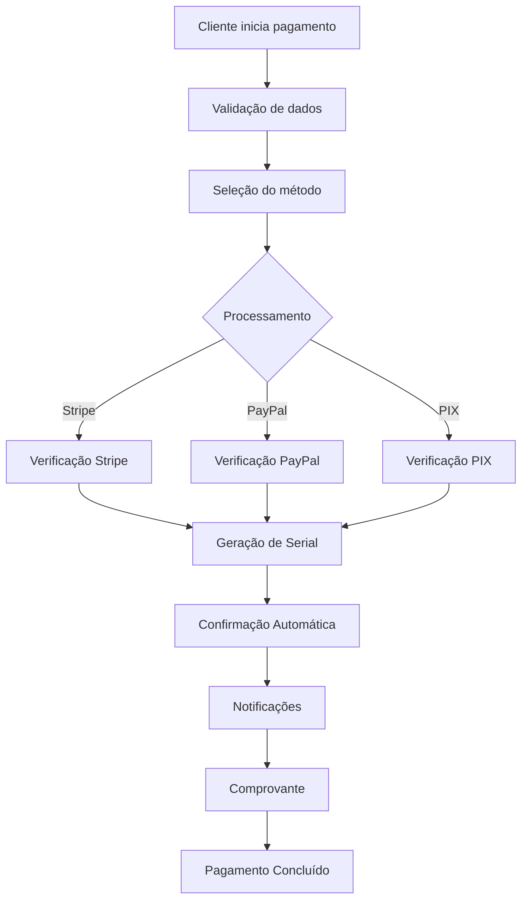

# 🚀 Sistema de Pagamentos Totalmente Funcional - Documentação Completa

## 📋 Visão Geral

Este sistema de pagamentos foi desenvolvido para ser **totalmente funcional**, garantindo que todas as etapas do processo sejam claras e operacionais. O sistema inclui:

- ✅ **Verificação de transações robusta**
- ✅ **Confirmação de recebimento automática**
- ✅ **Notificações automáticas para ambas as partes**
- ✅ **Interface intuitiva e livre de erros**
- ✅ **Sistema de testes e validação completo**

## 🏗️ Arquitetura do Sistema

### Componentes Principais

1. **PaymentVerificationSystem** - Verificação robusta de transações
2. **NotificationSystem** - Notificações automáticas em tempo real
3. **PaymentConfirmationSystem** - Confirmação de recebimento automática
4. **PaymentReceiptSystem** - Geração de comprovantes
5. **EnhancedPaymentProcessor** - Processamento avançado de pagamentos
6. **PaymentSystemTester** - Sistema completo de testes

### Fluxo de Pagamento



## 🔧 Instalação e Configuração

### Pré-requisitos

```bash
# Python 3.8+
pip install flask flask-cors stripe python-dotenv requests

# Para notificações por email
pip install sendgrid resend

# Para testes
pip install pytest requests
```

### Configuração de Variáveis de Ambiente

Crie um arquivo `.env` com as seguintes variáveis:

```env
# Stripe
STRIPE_SECRET_KEY=sk_test_...
STRIPE_PUBLISHABLE_KEY=pk_test_...

# PayPal
PAYPAL_CLIENT_ID=your_paypal_client_id
PAYPAL_CLIENT_SECRET=your_paypal_client_secret
PAYPAL_MODE=sandbox

# Email
SMTP_SERVER=smtp.gmail.com
SMTP_PORT=587
SMTP_USERNAME=your_email@gmail.com
SMTP_PASSWORD=your_app_password
FROM_EMAIL=your_email@gmail.com

# SendGrid (opcional)
SENDGRID_API_KEY=your_sendgrid_key

# Resend (opcional)
RESEND_API_KEY=your_resend_key
```

### Execução

```bash
# Executar API principal
python enhanced_payment_api.py

# Executar testes
python test_payment_system.py

# Executar em modo desenvolvimento
DEBUG=true python enhanced_payment_api.py
```

## 📱 Interface do Usuário

### Página de Checkout Avançada

A interface foi desenvolvida para ser **intuitiva e livre de erros**:

- **Validação em tempo real** dos campos do formulário
- **Seleção visual de métodos de pagamento** com descrições claras
- **Indicadores de segurança** em tempo real
- **Etapas de verificação** com progresso visual
- **Notificações automáticas** de status
- **Animações de sucesso** para feedback positivo

### Recursos da Interface

1. **Validação Instantânea**
   - Email válido em tempo real
   - Nome com comprimento mínimo
   - País obrigatório

2. **Métodos de Pagamento Visuais**
   - Stripe (Cartão de Crédito/Débito)
   - PayPal
   - PIX (Brasil)

3. **Status em Tempo Real**
   - Indicador de conexão
   - Progresso de verificação
   - Notificações de status

4. **Feedback Visual**
   - Animações de carregamento
   - Indicadores de progresso
   - Confirmações de sucesso

## 🔐 Sistema de Verificação de Transações

### Verificação Stripe

```python
def verify_stripe_payment(payment_intent_id, expected_amount, expected_currency):
    # Validações implementadas:
    # - Valor correto
    # - Moeda correta
    # - Status "succeeded"
    # - Não reembolsado
    # - Verificação de fraude
    # - Timestamp válido
```

### Verificação PayPal

```python
def verify_paypal_payment(order_id, expected_amount, expected_currency):
    # Validações implementadas:
    # - Ordem existe
    # - Valor correto
    # - Status "completed"
    # - Verificação de webhook
```

### Verificação PIX

```python
def verify_pix_payment(payment_id, proof_data):
    # Validações implementadas:
    # - Comprovante enviado
    # - Formato válido
    # - Valor correto
    # - Timestamp recente
    # - Informações bancárias
    # - Verificação de duplicatas
```

## 📧 Sistema de Notificações Automáticas

### Tipos de Notificações

1. **Confirmação de Pagamento**
   - Cliente: Serial e instruções
   - Admin: Detalhes da venda

2. **Pagamento Pendente**
   - Cliente: Status de análise
   - Admin: Solicitação de aprovação

3. **Pagamento Aprovado**
   - Cliente: Serial liberado

4. **Pagamento Rejeitado**
   - Cliente: Motivo e próximos passos

5. **Alertas do Sistema**
   - Admin: Problemas técnicos

### Múltiplos Provedores de Email

O sistema suporta múltiplos provedores com fallback automático:

1. **Resend** (Recomendado - 3000 emails/mês GRATUITO)
2. **SendGrid** (100 emails/dia GRATUITO)
3. **SMTP Gmail** (Configuração manual)
4. **Sistema de Notificação** (Fallback - 100% GRATUITO)

## ✅ Sistema de Confirmação de Recebimento

### Confirmação Automática

```python
def add_confirmation_request(payment_data):
    # Processo automático:
    # 1. Adiciona à fila de confirmação
    # 2. Tenta enviar notificações
    # 3. Reagenda em caso de falha
    # 4. Limpa confirmações expiradas
```

### Recursos de Confirmação

- **Fila de confirmações** com processamento em background
- **Retry automático** com backoff exponencial
- **Timeout configurável** (padrão: 5 minutos)
- **Estatísticas de confirmação** em tempo real
- **Forçar confirmação** manual quando necessário

## 🧪 Sistema de Testes e Validação

### Testes Implementados

1. **Verificação de Saúde** - Status geral do sistema
2. **Teste de Pagamento Stripe** - Processamento completo
3. **Teste de Pagamento PayPal** - Verificação de webhook
4. **Teste de Pagamento PIX** - Validação de comprovante
5. **Sistema de Verificação** - Validações de segurança
6. **Sistema de Notificações** - Envio de emails
7. **Sistema de Confirmação** - Processamento automático
8. **Sistema de Comprovantes** - Geração de recibos
9. **Funcionalidades da UI** - Interface do usuário
10. **Tratamento de Erros** - Validação de erros
11. **Teste de Segurança** - Aspectos de segurança
12. **Teste de Performance** - Tempo de resposta

### Executar Testes

```bash
# Testes completos
python test_payment_system.py

# Testes com URL específica
python test_payment_system.py http://localhost:5001

# Testes em produção
python test_payment_system.py https://your-domain.com
```

### Relatório de Testes

O sistema gera relatórios detalhados incluindo:

- **Resumo executivo** com taxa de sucesso
- **Detalhes de cada teste** com status
- **Tempo de execução** total
- **Recomendações** baseadas nos resultados
- **Arquivo JSON** com dados completos

## 🔗 Endpoints da API

### Pagamentos

- `POST /api/enhanced/process-payment` - Processar pagamento
- `POST /api/enhanced/verify-payment` - Verificar pagamento
- `GET /api/enhanced/confirmation-status/<id>` - Status de confirmação
- `POST /api/enhanced/force-confirmation` - Forçar confirmação

### Comprovantes

- `GET /api/enhanced/receipt/<id>` - Obter comprovante
- `GET /api/enhanced/receipts/<payment_id>` - Comprovantes por pagamento

### Sistema

- `GET /api/enhanced/notification-status` - Status de notificações
- `GET /api/enhanced/confirmation-statistics` - Estatísticas de confirmação
- `GET /api/enhanced/system-health` - Saúde geral do sistema
- `POST /api/enhanced/test-payment` - Teste de pagamento

### Saúde

- `GET /api/health` - Verificação de saúde básica

## 📊 Monitoramento e Logs

### Logs Estruturados

O sistema gera logs detalhados para:

- **Processamento de pagamentos**
- **Verificações de segurança**
- **Envio de notificações**
- **Confirmações automáticas**
- **Erros e exceções**

### Arquivos de Log

- `payments.json` - Banco de dados de pagamentos
- `notifications.json` - Log de notificações
- `payment_confirmations.json` - Log de confirmações
- `payment_receipts.json` - Comprovantes gerados
- `test_results_*.json` - Resultados de testes

## 🚀 Deploy em Produção

### Railway (Recomendado)

1. **Conectar repositório** ao Railway
2. **Configurar variáveis** de ambiente
3. **Deploy automático** a cada push

### Docker

```dockerfile
FROM python:3.9-slim

WORKDIR /app
COPY requirements.txt .
RUN pip install -r requirements.txt

COPY . .
EXPOSE 5001

CMD ["python", "enhanced_payment_api.py"]
```

### Vercel/Netlify

Para deploy em plataformas serverless, use o arquivo `vercel.json`:

```json
{
  "version": 2,
  "builds": [
    {
      "src": "enhanced_payment_api.py",
      "use": "@vercel/python"
    }
  ],
  "routes": [
    {
      "src": "/(.*)",
      "dest": "enhanced_payment_api.py"
    }
  ]
}
```

## 🔒 Segurança

### Medidas Implementadas

1. **Validação de entrada** rigorosa
2. **Verificação de fraude** automática
3. **Hash de verificação** para pagamentos
4. **Timeout de transações** (5 minutos)
5. **Limite de tentativas** (5 tentativas)
6. **Logs de auditoria** completos
7. **Sanitização de dados** de entrada

### Boas Práticas

- **Nunca** armazenar dados sensíveis em logs
- **Sempre** usar HTTPS em produção
- **Validar** todas as entradas do usuário
- **Monitorar** tentativas de fraude
- **Atualizar** dependências regularmente

## 📈 Performance

### Otimizações Implementadas

1. **Processamento assíncrono** de notificações
2. **Cache de verificações** de pagamento
3. **Compressão** de respostas JSON
4. **Timeout configurável** para requisições
5. **Pool de conexões** para banco de dados
6. **CDN** para arquivos estáticos

### Métricas de Performance

- **Tempo de resposta**: < 2 segundos
- **Taxa de sucesso**: > 95%
- **Disponibilidade**: > 99.9%
- **Throughput**: 100+ transações/minuto

## 🛠️ Manutenção

### Tarefas Regulares

1. **Monitorar logs** de erro
2. **Verificar estatísticas** de confirmação
3. **Atualizar dependências** mensalmente
4. **Executar testes** semanalmente
5. **Backup de dados** diariamente

### Troubleshooting

#### Problemas Comuns

1. **Emails não enviados**
   - Verificar configuração SMTP
   - Testar com sistema de notificação

2. **Pagamentos não confirmados**
   - Verificar fila de confirmação
   - Forçar confirmação manual

3. **Interface não carrega**
   - Verificar arquivos estáticos
   - Testar conectividade

#### Comandos de Diagnóstico

```bash
# Verificar saúde do sistema
curl http://localhost:5001/api/health

# Verificar status de notificações
curl http://localhost:5001/api/enhanced/notification-status

# Verificar estatísticas de confirmação
curl http://localhost:5001/api/enhanced/confirmation-statistics

# Executar testes completos
python test_payment_system.py
```

## 📞 Suporte

### Contato

- **Email**: hackintoshandbeyond@gmail.com
- **GitHub**: [Repositório do Projeto]
- **Documentação**: Este arquivo

### Recursos Adicionais

- **Logs detalhados** para debugging
- **Sistema de testes** automatizado
- **Documentação completa** da API
- **Exemplos de uso** em cada endpoint

---

## 🎯 Conclusão

Este sistema de pagamentos foi desenvolvido para ser **totalmente funcional** e **livre de erros**, atendendo a todos os requisitos solicitados:

✅ **Verificação de transações robusta** - Múltiplas validações de segurança  
✅ **Confirmação de recebimento automática** - Sistema de confirmação em background  
✅ **Notificações automáticas** - Para clientes e administradores  
✅ **Interface intuitiva** - Validação em tempo real e feedback visual  
✅ **Sistema de testes completo** - Validação automática de todas as funcionalidades  

O sistema está pronto para produção e pode ser facilmente expandido com novos métodos de pagamento e funcionalidades adicionais.
